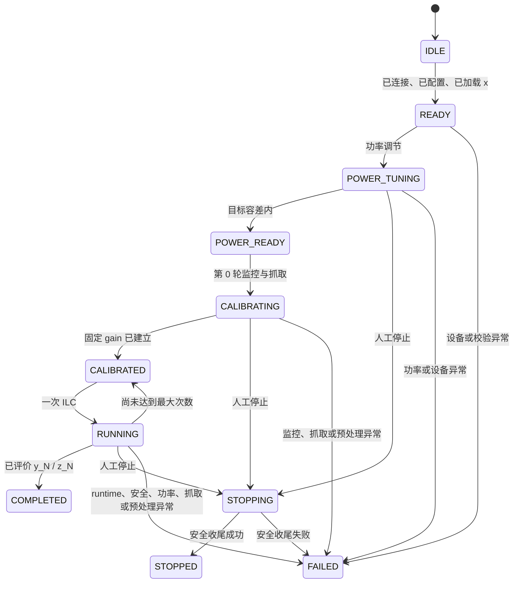

# 闭环控制与功率安全设计

本文描述 `remote_dpd/power_control.py` 和 `remote_dpd/controller.py` 的当前实现。控制器可由 Python API 直接调用，也已同时接入 CLI 文件命令服务和可信网络 Web 控制台。

## 1. 配置和单任务边界

`ClosedLoopConfig` 组合：

- 已校验的 `DeviceConfig`；
- runtime 注册名和递归不可变的 runtime 配置，默认是 `basic_ilc` 与 `mu=0.5`；
- 正整数 `max_iterations`；
- `normalize_reference_rms` 开关，默认 `true`；
- `reference_target_rms_dbfs`，默认 `-15.0`，允许有限 `[-120, 0] dBFS`。

Controller 保存的生效配置始终描述实际执行的参数：`apply_config` 用 runtime 的归一化结果（默认值补齐，例如 `forward_model_ilc` 的 `orders/memory_depths/ridge` 和 `basic_ilc` 的 `mu`）替换调用方原始 `runtime_config`，与设备 schema 归一化后的 `device_options` 同等对待。snapshot、run 记录和正式结果 MAT 因此总是记录完整生效配置，调用方省略的字段不会在结果中缺失。

Controller 保留只读源波形，并从源波形一次性生成生效 `x`：

```text
source_rms = sqrt(mean(abs(source) ** 2))
target_rms = 10 ** (reference_target_rms_dbfs / 20)
scale = target_rms / source_rms
x = source * scale
```

关闭归一化时 `scale=1`。缩放是整条复数波形的单一正实数乘法，不改变相位、频谱形状、PAPR 或样点数。应用新配置时始终从源波形重算，避免重复缩放并允许切换开关/目标。只有生效 `x` 接受既有峰值安全检查并成为 `y₀`、runtime/预处理参考、snapshot 和存储 reference；系统不削峰。source 必须一维、非空、有限且非零 RMS，开启归一化时允许 source 原始峰值超过满量程，只要生效 `x` 最终通过安全检查。

应用配置时，控制器先通过 `RFBench.parameter_schema` 校验专属配置并补齐所有默认项，再把这份实际生效配置交给设备并保存到 snapshot。`ClosedLoopConfig.to_dict()` 返回严格 JSON 结构；复数和 NumPy array 使用带 `$type`、dtype、shape 和 data 的显式表示。array 只接受 bool、常规精度数值/复数和 Unicode dtype，避免产生无法可靠序列化的 bytes、datetime、structured 或扩展精度标量。

`ClosedLoopController` 独占一个 `RFBench`，使用非阻塞操作锁拒绝并发修改命令。每个实例只运行一项任务，不提供排队、多用户或多设备并行。公开 snapshot、配置、波形和迭代记录均使用不可变对象或不可写数组。

## 2. 状态机



控制器还公开 `IDLE`、`READY`、`POWER_TUNING`、`POWER_READY`、`CALIBRATING`、`CALIBRATED`、`RUNNING`、`STOPPING`、`COMPLETED`、`STOPPED` 和 `FAILED` 全部枚举值。

`READY` 要求设备已连接并应用配置，同时已形成生效参考 `x`。load-before-config 使用默认 `true/-15 dBFS` 形成暂定 `x`；后续配置仍从保留的 source 重算。修改配置或参考会先停止发射，重建 runtime，并清除功率锁定、固定增益和全部迭代记录。换入新 `x` 后首次启动会在停止状态显式恢复 `initial_attenuation_db`，再上传和发射，禁止新波形短暂沿用旧任务的较小锁定衰减；只有同一个已经调功率的 `x` 在 `POWER_READY` 状态停止后重启时才保留锁定值。运行中修改被单操作锁或状态检查拒绝。

## 3. 分步与自动命令

公开分步命令包括：

- `connect()` / `disconnect()`；
- `apply_config()`；
- `load_reference()`；
- `start_reference_transmission()` / `stop_transmission()`；
- `tune_power()`；
- `calibrate()`；
- `step()`；
- `request_stop()`；
- `reset()` 和 `snapshot()`。

`run_auto()` 接受 `READY`、`POWER_READY` 或 `CALIBRATED`，自动补齐尚缺的安全前置步骤，然后运行到 `max_iterations`。非法顺序在调用设备前抛出 `ControllerStateError`。

第 0 轮发送 `y_0=x`，完成初始功率调节、一次额外物理功率安全监控和反馈抓取，再建立固定增益并提交记录 0。每个 `step()` 生成并实际评价下一个整数轮次。配置 `max_iterations=N` 时，记录恰好包含第 0 轮至第 N 轮；最终导出的候选应取已经实际发射、监控和抓取的 `y_N`/`z_N`，不会生成未验证的 `y_(N+1)`。

## 4. 初始功率调节

`PowerController.tune()` 要求参考波形已经发射。它首先设置 `initial_attenuation_db`，每次设置后等待 `settle_seconds` 并测量：

```text
gap = target_power_dbm - measured_power_dbm

0 <= gap <= 0.2 dB  -> 成功
gap > 1.0 dB        -> 衰减减小 1.0 dB
0.2 < gap <= 1.0 dB -> 衰减减小 0.1 dB
```

`gap=1.0 dB` 采用保守的 `0.1 dB` 步进。`0.2 dB` 包含边界使用 `1e-12 dB` 的浮点比较容差，避免不同 dBm 基值的二进制减法把数学上的边界误判为超差；超过目标的判断仍保持严格。下一步越过最小衰减、达到最大调节次数、功率不是有限实数（bool 也视为非法）、超过目标或超过绝对安全上限都会 fail closed。若已有安全测量点，超过目标或安全上限时先恢复上一安全衰减，再抛出包含危险读数和限制值的结构化 `PowerControlError`。

成功结果包含锁定衰减、最终功率、最终 gap 和完整 `PowerAdjustment` 轨迹。后续 `monitor()` 只验证读数有限且不超过 `safety_power_limit_dbm`，不会因为偏离初始目标而重新调节衰减。

## 5. 单轮执行顺序

一次 ILC 严格按以下顺序执行：

1. runtime 根据上一条已提交记录计算 `y_candidate`。
2. 在停止当前安全波形之前，先检查候选有限、峰值不超过 `0 dBFS`、RMS 不超过 `RMS(x)+2 dB`。
3. 检查通过后执行 `stop_transmission → upload_waveform → start_transmission`；锁定 TX 衰减保持不变。
4. 抓反馈前读取一次物理功率，只检查绝对安全上限。
5. 根据 `receiver.max_capture_samples // len(x)` 计算每批最大完整段数，直到收满 `average_segment_count`。不能容纳一个完整周期时在配置或加载阶段拒绝；`len(x) * average_segment_count` 不得超过 1000 万样点。
6. 使用每轮时延/相位对齐、跨段平均和第 0 轮固定增益生成 `z_i`。
7. 只有上述步骤全部成功后才原子追加 `IterationRecord`。

候选数字检查失败时，不停止或上传候选，也不执行物理功率测量和抓取；任务随后进入统一失败收尾。物理功率越界发生在上传之后，但一定在抓反馈之前，因此越界轮不会产生伪造的反馈记录。

controller 会保留第 0 轮至第 N 轮的波形和诊断，因此还要求 `len(x) * (max_iterations + 1)` 不超过 2000 万样点。两项乘积预算在配置与参考同时可用时、任何抓取或迭代开始前校验，防止合法单项上限组合成不可承受的内存请求。

## 6. 迭代记录和 snapshot

每个 `IterationRecord` 保存：

- 轮次、不可写 `y` 和 `z`；
- 本轮反馈前的物理功率和首轮锁定衰减；
- 数字安全报告；
- 完整预处理结果和 runtime 指标。

`ControllerSnapshot` 提供一致的状态、设备注册名、连接/配置/发射标记、当前操作、停止标记、最大/当前轮次、固定增益、锁定衰减、最近一次实际监控功率、参考安全报告、reference normalization 报告、全部已提交记录、功率调节轨迹、终态 UTC 时间和最后结构化错误。归一化报告包含开关、source/effective RMS 及 dBFS、目标、线性比例和 scale dB。最近功率独立于已提交记录，因此功率越界或后续抓取失败时仍保留触发本轮行为的读数。`y`/`z` 属性只引用最新完整记录。

`completed_at` 在控制器实际进入 `COMPLETED`、`STOPPED` 或 `FAILED` 时写入，并在该终态内保持不变；复位、换参考或重新应用配置会随运行状态一起清除它。正式结果即使稍后才导出，也使用该真实终态时间。

## 7. 人工停止和错误收尾

设备调用是同步的，但所有调用都有超时。有活动操作时，`request_stop()` 不等待操作锁，只设置线程安全 Event；运行操作会在每个设备调用前后以及各批次之间检查。没有活动操作时，请求方会取得操作锁并直接完成安全收尾。停止延迟因此受当前设备调用超时和功率稳定等待时间限制。

人工停止、功率取消、runtime 异常、数字安全失败、设备异常、抓取错误和预处理错误最终都调用 `RFBench.safe_shutdown()` 并关闭 runtime。正常完成最大迭代次数也停止 RF 并关闭 runtime。runtime 只有在 `close()` 成功后才清除控制器引用；替换过程中旧 runtime 关闭失败时会关闭新建实例并在统一收尾中重试旧实例。安全收尾自身失败会记录到 `ControllerErrorInfo.shutdown_error` 并把终态升级为 `FAILED`。

停止请求和活动操作之间使用状态锁完成无丢失交接，但慢速 `safe_shutdown()` 不持有状态锁；因此 snapshot 和重复停止请求在设备收尾期间仍可立即观察 `STOPPING`。

对已经处于 `COMPLETED`、`STOPPED` 或 `FAILED` 且无活动操作的控制器再次请求停止是无副作用操作，不会重写终态。
