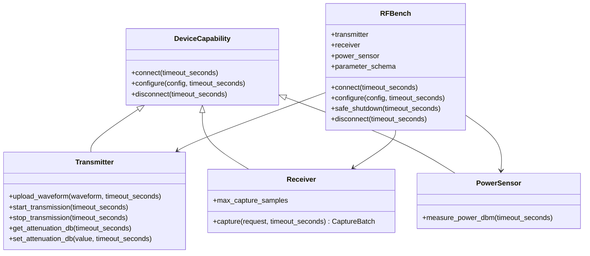

# 设备能力契约设计

本文描述 `remote_dpd/device.py` 当前已经实现的稳定设备层契约。当前仓库尚未提供仿真或真实设备实现，现有文件监听服务也尚未调用这些接口。

## 1. 设计目标

设备层按能力而不是厂商或型号拆分，使一台一体式仪器可以同时实现多项能力，也允许信号源、接收机和功率计分别实现后再由 `RFBench` 组合。

设备层只定义配置、生命周期和原始 I/O，不负责反馈预处理、ILC、功率调节策略、任务状态或结果保存。

## 2. 公共配置

`DeviceConfig` 是不可重新绑定字段的 dataclass，构造时归一化和校验以下公共字段：

| 字段 | 约束与含义 |
| --- | --- |
| `center_frequency_hz` | 正有限数，公共中心频率 |
| `sample_rate_hz` | 正有限数，参考、发射和反馈的约定采样率 |
| `tx_channel` / `rx_channel` | 非空通道标识 |
| `trigger` | 非空触发源标识 |
| `average_segment_count` | 正整数，目标反馈周期段数 |
| `target_power_dbm` | 初始功率调节目标 |
| `safety_power_limit_dbm` | 独立绝对安全上限，不得低于目标功率 |
| `initial_attenuation_db` | 初始 TX 衰减，必须位于最小值和最大值之间 |
| `min_attenuation_db` / `max_attenuation_db` | 非负且有序的 TX 衰减范围 |
| `settle_seconds` | 每次功率调节后的非负稳定等待时间 |
| `max_adjustments` | 初始功率调节的最大正整数次数 |
| `call_timeout_seconds` | 设备调用的正有限超时 |
| `device_options` | 适配器专属、JSON 兼容且递归不可变的配置 mapping |

NumPy 数值标量在构造时转换为内建 `int`/`float`，mapping 和 array 递归复制并冻结；NaN、Inf 和非 JSON 值被拒绝。`to_dict()` 返回完全分离、可由 `json.dumps(..., allow_nan=False)` 序列化的内建结构。配置模型只表达设备需要的值；`1 dB`/`0.1 dB` 调节规则、`0.2 dB` 容差和每轮安全判断属于后续应用控制层。

## 3. 动态参数 schema

`DeviceParameterSchema` 使用正整数 `schema_version` 和唯一 `device_type` 描述一个适配器的专属字段。每个 `DeviceParameterField` 声明：

- 字段名和 `string`、`integer`、`number`、`boolean`、`array` 或 `object` 类型；
- 可选单位、数值上下限、步进、枚举、默认值、必填标记和说明；
- array 的递归 `items` schema，以及 object 的递归 `properties` 和额外字段策略；
- 可由 API/UI 消费的 JSON 兼容字典形式。

`validate_options()` 拒绝未知字段，校验类型、范围、步进和枚举，补入默认值，并检查必填项。嵌套 schema 可以把 PA 系数表表达为 object array，其中 `p` 使用 `minimum=1, step=2` 限制为正奇数，`m` 使用 `minimum=0`，实部和虚部使用 number。网页阶段将直接消费该 schema 生成设备专属表单。

## 4. 能力接口

`CaptureRequest` 只允许正整数 `segment_length` 和 `segment_count`，并提供总样点数。`Receiver.capture()` 必须精确返回对应的 `CaptureBatch`；应用层根据 `max_capture_samples` 拆分多次请求。

`RFBench` 负责所有底层仪器只连接或释放一次，并提供统一 `safe_shutdown()`。接口允许 `transmitter`、`receiver` 和 `power_sensor` 返回同一个一体式对象，也允许返回三个独立对象。所有可能阻塞的方法都显式接收 `timeout_seconds`；`max_capture_samples` 和参数 schema 必须是适配器缓存的本地能力信息，不得在 property 读取中执行无界硬件 I/O。

## 5. 当前边界

设备注册表通过 `register_rf_bench()`、`create_rf_bench()` 和 `list_rf_benches()` 按规范化名称管理无参数 factory。每次创建返回独立 `RFBench`；factory 返回错误类型时立即拒绝。内置注册名当前只有 `simulated`，使用延迟导入避免设备抽象反向依赖具体仿真实现。后续真实设备适配器沿用同一注册入口。

- 接口是同步的；调用超时由适配器和后续控制层共同落实。
- 契约不提供真实硬件线程安全或事务保证；系统按单任务串行调用。
- `upload_waveform()` 不允许隐式缩放、AGC 或削峰，数字安全由调用前的独立安全模块保证。
- 当前首个具体实现是阶段 2 的 `SimulatedRFBench`，同时实现三个能力并由控制器完成契约测试；真实设备适配器仍不在当前范围。
