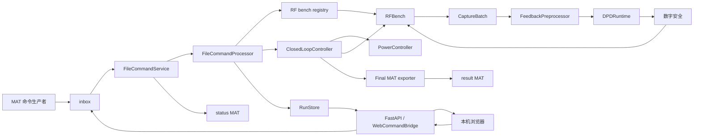

# Remote DPD 系统设计

本文描述当前仓库中 `remote-dpd` 的实际实现。代码和自动化测试是行为的最终依据；未实现能力会明确列出。

## 1. 系统定位

`remote-dpd` 是一个不依赖 MATLAB 的单任务 ILC DPD 闭环平台。当前核心链路直接通过设备能力接口发送周期 IQ、测量物理功率和抓取反馈；内置 `SimulatedRFBench` 可以在没有真实仪器时完成完整闭环。

当前能力边界：

- 内置两个 ILC runtime：基础形式 `y_next = y_current - mu * (z_current - x)`，以及每轮先以复 LS 拟合 PA 前向模型、再把误差经模型 Jacobian 伴随反向传播到 PA 输入位置的 `forward_model_ilc`；PA 深度压缩时只有后者保持单调收敛。
- 内置 `simulated` 与真机 `vst5842`（本机 NI RFIC 测试站适配器，经 NI RFIC SCPI 服务器驱动 PXIe-5842 收发，需 `real-hardware` 可选依赖与本机 NI 软件栈）；其他一体式或分立仪器适配器按需注册。
- 对外常驻入口可选择版本化 inbox/outbox MAT 命令服务或可信网络 Web 控制台；Web 模式同进程保留 MAT watcher。
- 一次只运行一个非 stop 命令和一个闭环任务；不恢复未完成的硬件会话，不提供多用户或设备并行。
- 任务完整历史保存为自动清理的临时 artifact；正式 MAT 只保存最终 `x/y/z` 和最终指标。
- 不兼容旧 `Config_file.mat`、`DPD_in.mat`、`FB_Signal.mat`、ACK、心跳、`safeBack` 或特殊十段输出协议。

## 2. 环境和部署单元

项目要求 Python 3.10 或更高版本：

| 依赖 | 当前用途 |
| --- | --- |
| NumPy `>=1.24` | IQ、FFT、PA、ILC、指标和 NumPy artifact |
| SciPy `>=1.10` | MAT v5/v6/v7 加载和原子结果写入 |
| watchdog `>=3.0` | inbox 创建/原子移动事件监听 |
| FastAPI `>=0.135,<1` | 本机 REST/SSE、静态控制台和严格请求边界 |
| uvicorn `>=0.30,<1` | 默认 loopback、可显式可信 LAN、单 worker 的 Web ASGI 服务 |
| h5py（可选） | MAT v7.3/HDF5 的有限顶层 dataset 回退 |
| `real-hardware` 可选组（PyVISA/nptdms） | 真机适配器 `vst5842` 的运行时包（SCPI 会话与 TDMS 波形写出）；NI-VISA 与 NI RFIC 软件栈由本机提供 |

项目不再依赖 PyTorch、MATLAB Engine、MATLAB Runtime 或 MATLAB License。

CLI 入口为：

```text
remote-dpd = remote_dpd.cli:main
```

常驻启动示例：

```bash
remote-dpd --exchange-root /opt/remote-dpd/exchange
```

主要参数：

| 参数 | 默认值 | 含义 |
| --- | --- | --- |
| `--exchange-root` | 必填 | 包含 inbox/outbox 的交换根目录 |
| `--runtime-root` | `<exchange-root>/runtime` | 临时运行存储根 |
| `--mode` | `file` | `file` MAT 常驻模式或 `web` 本机控制台模式 |
| `--waveform-root` | `<exchange-root>/waveforms` | Web 可浏览 waveform 根 |
| `--web-host` | `127.0.0.1` | IPv4 bind；可信 LAN 显式使用 `0.0.0.0` |
| `--web-allowed-host` | 空 | 可重复的精确私网 Host 白名单；非 loopback bind 必填 |
| `--web-port` | `8000` | Web 端口 |
| `--retention-days` | `7` | 临时 run 保留天数 |
| `--cleanup-interval-seconds` | `86400` | 周期清理间隔 |
| `--status-poll-seconds` | `0.02` | 自动 run 状态轮询间隔 |
| `--once` | false | 同步扫描当前命令后退出 |
| `--log-level` | `INFO` | Python 日志级别 |

项目没有容器、systemd、进程守护或日志轮转配置，部署环境需要自行提供。

## 3. 总体架构



唯一闭环实现位于 `ClosedLoopController`。Web 和外部 MAT 生产者都进入同一个 `FileCommandService` 仲裁器；入口只解析/持久化命令、管理 controller 生命周期、同步存储并投递状态，设备、预处理和算法均不知道浏览器、MAT 文件或 watcher。

## 4. 模块职责

| 模块 | 职责 |
| --- | --- |
| `device.py` | 公共设备配置、递归动态 schema、能力 ABC 和 RF bench factory 注册表 |
| `simulation.py` | 集成式仿真发射/接收/功率设备、周期有记忆 PA 和扰动 |
| `dsp.py` | RMS、NMSE、周期 FFT 插值、小数移位和对齐原语 |
| `preprocessing.py` | `CaptureBatch`、每批时延/相位对齐、相干平均和固定增益 |
| `runtime.py` | 版本化 `DPDRuntime`、基础/前向模型 ILC 和算法注册表 |
| `safety.py` | TX 候选峰值/RMS 的非修改式数字检查 |
| `power_control.py` | 初始衰减调节、越界恢复、调节轨迹和后续功率监控 |
| `controller.py` | 分步/自动状态机、抓取拆批、原子迭代提交、停止和安全收尾 |
| `storage.py` | 完整临时 run、幂等 artifact、清理 guard 和周期清理 |
| `result_export.py` | 最终 `x/y/z`、指标和实际配置的 MAT 契约 |
| `protocol.py` | 通用 MAT 加载和原子保存 helper |
| `file_interface.py` | 新 MAT 命令/状态、幂等、busy、stop、watchdog 和启动扫描 |
| `waveforms.py` | 锚定目录描述符的安全 waveform 浏览、MAT `x` 校验和有界 preview |
| `web_analysis.py` | 完整周期频谱、measurement-band/ACLR/PAPR、AM/AM/AM/PM 和有界分析缓存 |
| `web_bridge.py` | Web 命令到共享文件仲裁器的映射、状态/metrics/run DTO 和抽样 |
| `web.py` / `web_static/` | 可信网络 FastAPI、REST/SSE、安全中间件和原生单页控制台 |
| `real_bench.py` | 本机真机适配器 `vst5842`：经 RFIC SCPI 服务器的 PXIe-5842 发射/接收、N1912A 功率计和 44 V 电源守卫（见 `docs/real_bench_design.md`） |
| `cli.py` | file/web 模式参数、RunStore/FileCommandService/uvicorn 生命周期 |
| `exceptions.py` | 通用 MAT 错误层次 |

稳定文档导航见 `docs/README.md`，模块细节不在本文重复。

## 5. 设备和数据模型

`RFBench` 聚合 `Transmitter`、`Receiver` 和 `PowerSensor`。一体式设备可让三个属性返回同一对象，分立仪表可由组合实现协调。所有潜在阻塞调用显式携带超时；`max_capture_samples` 和参数 schema 必须是本地缓存信息。

`DeviceConfig` 保存中心频率、采样率、通道、触发、平均段数、目标/安全功率、衰减范围、稳定时间、调节次数、调用超时和递归冻结的专属配置。设备 schema 校验并补齐 adapter 默认项，controller snapshot 保存实际生效值。

`ClosedLoopConfig` 提供默认开启的 reference RMS conditioning：源 IQ 进入 controller 后按配置从完整复数周期计算一次统一比例，生成生效 `x`，再依次进入数字安全、功率调节、预处理和 DPD runtime。文件与 Web 只传源波形和配置，不各自缩放；运行存储、分析和正式结果使用生效 `x`。默认数字目标为 `-15 dBFS`，公共默认物理目标功率为 `-15 dBm`；两个标度各自记录，数字归一化不替代设备侧功率控制。ILC 第 0 轮起点默认为确定性种子波形 `normalize(x + n)`：宽带高斯白噪声按积分带宽（默认 1 MHz）比载波总功率低 25 dB 注入后整体缩放回参考 RMS（详见 `controller_design.md` §1.1）；显式关闭后回到 `y₀=x`。

当前注册表内置 `simulated`。仿真设备使用周期记忆多项式：

```text
u[n] = y[n] * 10 ** (-attenuation_db / 20)
pa[n] = sum(a[p,m] * u[n-m] * abs(u[n-m]) ** (p-1))
```

反馈再应用固定采集增益、相位、小数时延和固定种子噪声。功率测量使用无噪 PA 输出，不包含反馈采集增益。

## 6. 预处理和算法

参考 `x` 是固定周期目标。一次设备调用返回一个 `CaptureBatch`：同一 coherent 批次只从第一段估计周期小数时延和单位模相位，其余段复用；不同批次独立估计。所有段相干平均且不做异常剔除。

第 0 轮计算：

```text
gain_correction = RMS(x) / RMS(aligned_average)
z_0 = aligned_average * gain_correction
```

后续每轮继续估计时延和相位，但固定复用该正实增益，使硬件幅度变化进入 ILC 误差。预处理要求反馈采样率与参考一致，不执行隐式重采样。

`BasicILCRuntime` 默认 `mu=0.5`，`ForwardModelILCRuntime` 默认 `mu=1.0`。前向模型 runtime 每轮在当前 `(y, z)` 上做岭正则复 LS 拟合并用精确实梯度方向更新；其收敛稳定边界为 `mu < 2 / lambda_max(J^H J)`。runtime 输入和输出均是一维、有限、等长、不可写副本；算法不访问设备、原始抓取、文件或任务状态，也不执行预处理、AGC 或削峰。

## 7. 功率与闭环状态机

第 0 轮先以种子波形 `y₀`（默认 `normalize(x+n)`，见 §5；关闭种子噪声时为 `x`）从配置的大衰减开始发射。功率差大于 `1 dB` 时衰减减小 `1 dB`，其余未进入 `0.2 dB` 容差时减小 `0.1 dB`。功率必须从目标下方进入包含边界的容差；超过目标或绝对安全上限时恢复上一安全衰减并失败。

成功后衰减固定。每轮候选按以下顺序执行：

```text
runtime step
-> 数字峰值/RMS检查
-> stop / upload / start
-> 物理功率监控
-> 完整周期抓取拆批
-> 预处理
-> 原子追加 IterationRecord
```

数字峰值限制为 `0 dBFS`，候选 RMS 不得超过 `RMS(x)+2 dB`；除明确配置的 reference RMS conditioning 外，系统禁止隐式 AGC、runtime 再归一化和静默削峰。物理功率监控超过绝对上限时不抓反馈。

控制器状态为 `IDLE/READY/POWER_TUNING/POWER_READY/CALIBRATING/CALIBRATED/RUNNING/STOPPING/COMPLETED/STOPPED/FAILED`。非阻塞单操作锁拒绝并发修改命令；stop 使用 Event 在设备调用边界取消。正常、停止和错误终态都安全停止 RF 并关闭 runtime。

`max_iterations=N` 时记录包含第 0 轮到第 N 轮，最终 `y_N/z_N` 已实际发射和评价，不生成未验证的下一轮。

## 8. 临时运行和最终结果

`RunStore` 为每个 run 建立独立目录，保存实际配置、`x`、事件、功率轨迹、最新 snapshot，以及每轮 `y/z/aligned_average` 和指标。相同轮次重放必须内容一致，否则冲突；所有单文件使用同目录临时文件和原子替换。

新 run 创建后自动获得 active guard；终态成功落 manifest 后释放。指向同一 root 的多个 `RunStore` 共享清理锁和 guard。完成 run 按“完整索引写入 `finalizing` manifest → `final_result.mat` 缓存 → `completed` manifest”两阶段提交。export guard 和 active guard 都阻止清理；默认按 manifest `updated` 保留 7 天，周期线程每 24 小时清理一次，只删除通过 manifest 和路径验证的受控直接子目录。

最终 MAT 只允许从 `COMPLETED` snapshot 生成，schema 2 固定包含 `schema_version/x/y/z/metrics/config/status/completed_at`，reader/recovery 兼容旧 schema 1。`x` 是 RMS conditioning 后的生效参考，`y/z` 是最终实际评价轮的复数列向量；`config` 是可由 MATLAB `jsondecode` 读取、包含 `device_type` 和归一化配置的严格 JSON；metrics 记录 source/effective RMS 与 scale；`completed_at` 是 controller 实际进入终态的时间；正式结果不包含迭代历史。

## 9. 文件命令协议

目录固定为：

```text
<exchange-root>/inbox/command_<command_id>.mat
<exchange-root>/outbox/status_<command_id>.mat
<exchange-root>/outbox/result_<command_id>.mat
```

命令 schema 当前为 1，公共变量是 `schema_version/command_id/action`，按动作可带 `x/config_json`。动作包括 `connect/disconnect/load/configure/start_transmission/stop_transmission/power_tune/calibrate/step/run/stop/reset/export`。

命令必须通过原子重命名正式发布。status 文件是持久幂等记录，包含命令关联的 `run_id`；自动 `run` 使用与 command ID 相同的专属 run。一个非 stop 命令在单 worker 中运行；忙时其他普通命令立即拒绝。stop 在同一个调度锁内识别当前任务并设置 processor 取消锁存，随后直接转发当前或 pending controller Event；`run` 期间只在状态或完整轮次变化时原子更新 status。

服务先启动 observer，再扫描启动前已有且没有任何持久证据的正式命令。重启后只恢复已经持久化的结果交付：有效 outbox 结果或 run 内最终缓存可补交 `completed` 状态，终态 manifest 可补交对应状态；无有效结果的遗留非终态 run 会标记为 `failed/service_restarted`。任何恢复路径都在 cleanup guard 内完成且不重放硬件动作。关闭时先关闭新命令入口并停止 observer，再请求活动任务停止、等待 worker；分步命令之间若仍在发射也会停止，非终态临时 run 记录为 `stopped`，最后释放 controller。

完整字段和 JSON 特殊类型见 `docs/file_interface_design.md`。

## 10. Web 控制台

Web 模式默认使用 `127.0.0.1`，可信 LAN 可显式绑定 `0.0.0.0` 并配置精确私网 Host 白名单；通配符、公网地址和未声明 Host 均拒绝。两种模式都只使用一个 uvicorn worker并关闭 proxy headers。FastAPI 与文件 watcher 共享同一 `FileCommandService`，Web 普通命令通过原子持久命令进入同一 busy 锁和 worker；Web/file 任一入口的 stop 都旁路 worker 使用同一 processor latch。Web safety stop 还会在等待普通命令持久化锁前设置独立 barrier，避免大 MAT 序列化延迟停发，因此两个入口不能并行驱动设备。

`WaveformRepository` 使用 root directory fd、`dir_fd` 和 `O_NOFOLLOW` 浏览/打开文件，只返回相对路径并拒绝所有 symlink、路径逃逸和非普通文件。加载时只接受通过文件/样点上限、类型、finite、非零 RMS 和 `0 dBFS` 安全检查的 MAT 变量 `x`。

修改请求要求同源 Origin、`application/json` 和自定义控制头，实际流式 body 上限 1 MiB，拒绝重复 key、非有限常量和过深/过大 JSON。服务不启用 CORS，TrustedHost 只接受 loopback 和显式私网地址。页面按设备 schema 生成配置和 PA 系数编辑，提供 R&S 风格固定单屏、默认仿真一键 run、配置/Expert/Runs dialogs、固定 RF abort、完整周期有界分析、历史 run inspector 和最终 MAT 下载。详细契约见 `docs/web_console_design.md`。

真机 bench 的 Web 集成：`vst5842` 位于 `device.py` 内置注册表，所有进程可见；每设备 Web quick-start 默认配置由 `RFBench.quick_start_configuration()` 契约提供；Web 页面对物理 bench 使用设备感知文案并在一键 run 前强制确认弹窗（`docs/web_console_design.md` §10）。真机运行安全语义：quick-start 默认 `target_power_dbm=38.0`（工作点）、`enable_supply_shutdown=false`（44 V 纯人工管理，run 终态只关 TX/RF）。`WaveformRepository` 与结果下载在 Windows 上使用路径锚定后备，MAT 原子写在 Windows 上带短暂替换重试（`docs/web_console_design.md` §10.4）。

### Web 射频分析边界

独立只读的 Web 射频分析层从当前 controller snapshot 或 cleanup guard 内的历史 `RunStore` 读取不可变 `x/y/z`，计算完整周期 `Z₀/Zₙ/(Zₙ-X)` 频谱、支持多 TX reference 的 measurement-band/ACLR 功率、PAPR 以及有界 AM/AM、AM/PM 数据；它不属于 controller、预处理器或 DPD runtime，不持有设备对象，也不能改变 RF、命令、run manifest 或正式结果。

`AnalysisProfile` 是逐请求提交的版本化 Web 查询，包含相对/绝对频率显示和任意有界 measurement-band 表；它不写入原 waveform MAT、文件命令 schema、controller 配置或正式结果 MAT，也不提供跨会话 preset。频谱使用 `dBFS/bin`，物理总功率继续来自 power sensor `dBm`，在没有校准 IQ 标度时不得推导 `dBm/Hz`。EVM、连续扫频、RBW/VBW 和频谱 mask 不在当前范围。

分析计算与普通命令 worker、事件循环和 safety-stop barrier 隔离，使用单并发 gate、逐 trace 中间数组释放、有界结果缓存和独立输入/输出预算。分析端点即使使用 `POST` 承载结构化 profile 也保持语义只读，并继续执行现有 Host/Origin/JSON/自定义头/no-store 安全边界。任何分析错误或资源拒绝只影响该响应，不能阻塞或改变控制链。详细数值、UI 和 API 契约见 `docs/web_console_design.md`。

## 11. MAT 边界

通用 `load_mat()` 使用 SciPy 加载 v5/v6/v7，并递归解包 MATLAB struct、structured array 和 object array。仅当 SciPy 抛出 `NotImplementedError` 时尝试可选 h5py；该回退只支持有限顶层 dataset，不是完整 MATLAB v7.3 struct 解码器。Web waveform 的 v7.3 路径额外要求内部 hard link、固定 shape、常规数值宽度和有界 chunk，拒绝 external/virtual storage。

通用 `save_mat()` 生成 MAT v5，每个 writer 使用同目录唯一临时文件再原子替换，避免并发写争用固定临时名。文件命令状态也使用唯一临时名和串行写锁，避免进度更新并发覆盖。

## 12. 并发、恢复和安全边界

- 一个 `FileCommandService` 只有一个 controller 和一个非 stop worker。
- 状态文件、run manifest 和最终结果缓存提供进程重启后的持久幂等判断与已完成结果补交，但不恢复未完成 controller/runtime/设备状态。
- 输入目录只接受直接普通文件；run 存储拒绝符号链接和根目录替换。
- waveform root 只接受锚定目录下的真实目录和普通 MAT 文件；Web 不暴露绝对本地路径。
- controller 在配置/参考生效前限制每轮总抓取为 1000 万样点、参考长度乘保留轮数为 2000 万样点；Web 的 session、iteration preview 和 run detail 均使用独立递归输出预算。
- Web 模式无鉴权且无 TLS，仅以网络可信、精确 Host、同源 Origin、非 simple JSON 请求和 CSP 为应用边界；LAN 可达性不构成公网安全部署能力。
- 设备调用超时限制停止延迟；功率稳定等待也可能延迟取消检查。
- 用户自定义 PA 系数或 `mu` 不保证收敛，只有默认预设具备回归保证。
- 周期相关可能对高度重复波形产生多个相似峰；当前记录诊断但不做异常段剔除。

## 13. 测试和已知限制

自动测试覆盖：

- 设备配置/schema/注册表、仿真 PA、衰减、功率和抓取；
- 对齐、批次复用、相干平均、固定增益、基础 ILC 和数字安全；
- 功率粗细调、浮点边界、越界回退和非法读数 fail-closed；
- 分步/自动闭环、抓取拆批、并发 stop、runtime 清理和真实仿真收敛；
- 完整临时 artifact、幂等冲突、清理 guard、符号链接/路径逃逸和周期线程；
- 最终 MAT 字段、列向量、实际配置、最终轮选择和原子失败；
- 文件命令解析、分步/自动运行、busy、stop、幂等、启动扫描、原子状态、提交窗口故障注入和结果补交。
- waveform traversal/symlink/root 替换/FIFO/MAT 类型/数字安全/规模上限；
- Web Host/Origin/Content-Type/控制头/body/JSON、动态设备 schema、分步/自动命令、跨 Web/file busy 与 stop、run 浏览/preview/download；
- 完整周期 DFT、Parseval、Nyquist/band 边界、ACLR 符号、PAPR、AM/AM/AM/PM、分析资源预算和只读 session/run API；
- R&S 风格四工作区、RF 状态/abort、trace/marker、measurement-band、历史重分析和 `1920×1080`/`1366×768` 浏览器端到端；
- 真机适配器注册表集成、quick-start 契约三态（默认/simulated/vst5842）、Web 设备列表真机 profile 与 simulated 回归、Windows 平台文件访问后备。

符号链接拒绝与"root 路径替换不跟随"等 POSIX fd 语义测试在无法创建 symlink 或不支持描述符替换语义的主机（无特权 Windows）按 `tests/platform_guards.py` 探测结果跳过；POSIX 全量执行。Windows 主机的自动测试套件 2026-09-03 起全绿（276 passed / 9 skipped）。

当前尚未实现：

- 具体外部 DPD runtime 载体加载器；
- 未完成任务的进程重启恢复；
- 完整 MAT v7.3 struct/object-reference 解码。

真机适配器 `vst5842` 已实现并通过无硬件契约测试与真机闭环冒烟（2026-09-02，
脚本直连）；Web 工作台真机联调（Expert 手动 + 一键全自动）待用户安排窗口（见
`docs/real_bench_design.md` §7）。
