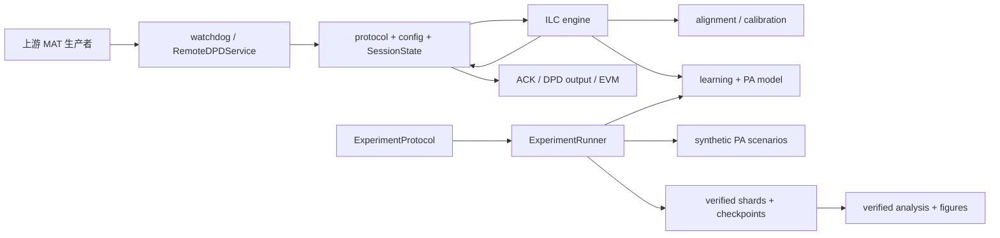

# Remote DPD 系统设计

## 1. 系统定位与边界

`remote-dpd` 包含两个共享数值核心、但运行边界不同的子系统：

1. 常驻文件服务：通过共享目录接收 MAT 配置、参考波形和反馈，维护内存会话并输出下一轮 DPD；
2. 可复现实验框架：直接调用数值算法和合成 PA，执行冻结矩阵、恢复、统计和论文图表导出。

两者均不依赖 MATLAB Engine、MATLAB Runtime 或 MATLAB License。文件服务面向既有传输兼容，默认
保持 legacy ILC；研究 runner 面向仿真机制验证，不经过 watchdog、ACK、文件去重或动态测量校准。

当前仓库没有真实 PA 闭环平台。研究结果只能说明预定义合成 PA 中的数值行为，不支持硬件、PAE、
热稳定性、3GPP 合规或产业部署宣称。

## 2. 模块划分

| 模块 | 职责 |
| --- | --- |
| `remote_dpd/protocol.py` | 文件名、MAT 加载/保存、MATLAB struct 解包与 IQ 校验 |
| `remote_dpd/config.py` | legacy `configDPD` 兼容、模型/校准/安全字段的强类型归一化与配置指纹 |
| `remote_dpd/state.py` | 会话状态、输入/反馈/输出内容指纹、冻结校准和外部 session |
| `remote_dpd/dsp.py` | RMS/NMSE、重采样、周期时延对齐、固定或动态校准、循环 FIR |
| `remote_dpd/pa_model.py` | 确定性 ridge-LS memory-polynomial 模型及解析 JVP/VJP |
| `remote_dpd/learning.py` | linear、instantaneous-gain、raw VJP、LM、CG、trust region 和输入投影 |
| `remote_dpd/algorithms.py` | engine 注册、legacy 兼容更新与文件服务算法编排 |
| `remote_dpd/service.py` | watchdog 生命周期、文件路由、绑定校验、状态提交、ACK/输出/心跳 |
| `remote_dpd/run_filewatch.py` | 文件服务 CLI |
| `experiments/waveforms.py` | 确定性 NR-like OFDM 和命名 SeedSequence |
| `experiments/scenarios.py` | 可微合成 PA、可达性和压力场景 |
| `experiments/config.py` | 冻结科学协议、pilot 候选与 trajectory 矩阵 |
| `experiments/runner.py` | 容量门、manifest、checkpoint、并行调度、恢复和自校验 shards |
| `experiments/statistics.py` | paired bootstrap、Holm 校正、pilot 选择和预注册判据 |
| `experiments/analysis.py` | 完整性验证、失败保留、端点与 CSV/JSON 导出 |
| `experiments/plot_results.py` | 从已验证结果生成固定样式 PNG/PDF 图 |



## 3. 部署与命令行

项目要求 Python 3.10 或更高。核心依赖为 NumPy、SciPy、PyTorch 和 watchdog；研究 extra 还包含
Matplotlib、psutil 与 PDF 工具。安装入口：

```text
remote-dpd = remote_dpd.run_filewatch:main
```

示例：

```bash
remote-dpd Zilink --watch-root /opt/SharePoint
remote-dpd lab --path D:\DPD\lab --engine model_lm_ilc
```

CLI 支持 `ilc`、`legacy_ilc`、`linear_ilc`、`instantaneous_gain_ilc`、`model_vjp_ilc`、
`model_lm_ilc`。`ilc` 按配置模式分派；其余显式 engine 覆盖配置中的 mode。默认心跳周期为 1800 秒，
日志级别可选 `DEBUG/INFO/WARNING/ERROR`。

一个服务实例只应监听一个专用供应商目录，并由一个上游控制器按顺序驱动。实现没有多生产者事务、
跨文件原子提交、服务状态持久化、容器编排或日志轮转。

## 4. 文件服务生命周期

### 4.1 启动与事件

`RemoteDPDService.start()` 创建监听目录、启动递归 watchdog Observer 和 daemon 心跳线程。服务只处理
启动后产生的创建、修改或移动事件，不主动扫描启动前已经存在且不再变化的输入。事件路径经过短时
去抖和 `(size, mtime_ns)` 稳定检查；超时只记录 warning，随后仍尝试读取。

事件处理线程把异常记录后继续常驻；测试或嵌入调用可直接调用同步 `process_file()`，该入口把异常
交给调用方。心跳写入 `sync_dat.txt`，计数器只存在于进程内存。

### 4.2 文件路由

| 输入 stem | 行为 |
| --- | --- |
| `Config_file` | 解析配置、构造 engine、按规则重置状态、写配置 ACK |
| `DPD_in` | 读取并裁剪参考，建立或保持会话、写输入 ACK |
| `FB_Signal` | 校验可选绑定、去重、执行一轮 ILC、写 DPD 输出和兼容 EVM |
| `safeBack` | 仅根目录触发；删除根目录普通文件并重置状态 |

其他 stem 被忽略。Observer 虽为递归监听，但协议输入和所有输出都应放在服务根目录。

### 4.3 MAT 边界

SciPy 负责 MAT v5/v6 读取与写入。加载器递归解包常见 scipy MATLAB struct、structured array、
object array 和 mapping；IQ 变量统一为一维 `complex128`。只有 SciPy 明确报告 v7.3 不支持时才尝试
可选 `h5py`，且只完整支持简单顶层 numeric dataset，不实现通用 v7.3 struct/object reference。

MAT 输出先写同目录临时文件，再以 `Path.replace()` 原子替换单个目标。一次反馈同时涉及内存状态、
DPD 输出和 EVM 三个提交点，整体不是事务。

## 5. 文件契约与绑定

### 5.1 输入

| 文件 | 接受变量 | 关键校验 |
| --- | --- | --- |
| `Config_file.mat` | 优先 `configDPD` struct，否则顶层 mapping | 标量、枚举、范围、有限性和模式冲突 |
| `DPD_in.mat` | `DPD_In_cut`、`DPD_in` 或 `DPDin` | 非空 numeric IQ；应用 `StartingSample-1` 裁剪后仍须非空 |
| `FB_Signal.mat` | `FB_Signal_cut`、`FB_Signal` 或 `feedback` | 非空 numeric IQ；必须已有参考 |

### 5.2 输出

| 文件 | 内容 |
| --- | --- |
| `Config_file_ack.mat` | `ACK` 与 UTC timestamp |
| `ACK_DPDin.mat` | `ACK_DPDin=1`、`DPDInputID`、`expectedFeedbackIteration=1` |
| `DPDout_Nokia.mat` | `DPDout_Nokia`、当前 `iter`、`nextFeedbackIteration`、`DPDOutputID`，可选 session/透传字段 |
| `symbolEVM.mat` | legacy `symbolEVM` 向量 |
| `sync_dat.txt` | 进程内心跳计数 |

`Reset=true` 仍保留历史 reset ACK 行为：配置 ACK 后另写 `ACK_DPDin.mat` 中的 `ACK=0`。

### 5.3 可选现代绑定

DPD 输入可携带 `session_id/SessionID/SessionId/IT_ID`。反馈可携带同一 session、
`iteration/Iteration/feedbackIteration/ITNum` 和 `DPDInputID/DPDOutputID/input_id/InputID`。
任何已提供字段都必须与当前状态一致，否则拒绝反馈；至少提供并通过一个绑定字段时记录
`feedback_binding_verified=true`。无绑定字段的旧文件继续兼容，但该轮明确记录 false。

内容 SHA-256 指纹用于相同输入会话识别、反馈幂等去重和输出绑定。不同外部 session 的新输入会先
重置状态。反馈在状态提交后若文件输出失败，原样重放仍可能被去重，因此上游应使用绑定字段并监控
输出，而不能把该路径当成完整事务日志。

## 6. 配置与会话状态

`LegacyConfig` 同时覆盖旧字段和新增强类型字段。旧的 `run_idealDPD`、`enILC`、`idealDPD` 只作为
兼容元数据，不选择 MARS/MADE。重要新增字段包括 `ILCBackwardMode`、`ILCCalibrationMode`、
`ILCCalibrationCoefficient`、PA 模型 order/depth/ridge/validation 门限、LM damping、CG 上限/容差、
trust ratio、输入 RMS/peak/PAPR 限制和模型 fallback。完整字段表见
[algorithm_design.md](algorithm_design.md)。

影响目标、校准或更新律的字段进入 `algorithm_config_fingerprint()`。非 legacy 会话中，已经加载过的
算法配置发生变化会自动重置状态；legacy 模式为兼容旧控制器保留原会话。显式 `Reset=true` 对所有
模式重置。

`SessionState` 保存：参考与当前 DPD、下一反馈迭代号、输入/反馈/输出/配置指纹、冻结反馈校准、
绑定验证状态、外部 session ID 和最近 metrics。新参考清除当前 DPD、反馈/输出指纹、校准与 metrics，
迭代号回到 1。状态只在内存中，进程重启不会恢复。

## 7. 算法模式

| engine / mode | 更新语义 | 校准与用途 |
| --- | --- | --- |
| `legacy_ilc / legacy` | 历史 `alpha/gain/phase/FIR` 更新 | 每轮动态 gain/phase 对齐；部署兼容 |
| `linear_ilc / linear` | 单位 Jacobian scalar ILC | 默认 `auto -> frozen_first` |
| `instantaneous_gain_ilc / instantaneous_gain` | 逐样点复割线增益的阻尼逆 | 默认 `auto -> frozen_first` |
| `model_vjp_ilc / model_vjp` | `-mu * J_model^T error` | 每轮在线模型；机制消融 |
| `model_lm_ilc / model_lm` | 阻尼 normal solve | 在线模型、CG、trust、预测回溯与硬投影 |

### 7.1 Legacy 路径

legacy 路径保留采样率转换、周期对齐、逐轮 RMS/全局相位归一化、可选 phase preconditioner、
`alpha`、gain 和两个循环 FIR。反馈长度为 327680 且参考至少 32768 点时，按历史 packed capture
语义训练 32768 点并把结果重复 10 次。默认 legacy 数值后端使用 PyTorch `complex64`，输出统一回到
NumPy `complex128`。

legacy 在 `gain_db=0`、`alpha=0`、关闭相位补偿和 FIR、采样率一致时退化为

```text
u_(k+1) = u_k + mu * (reference - measured).
```

其他 legacy 配置是工程扩展，不应冒充纯公开 linear ILC。

### 7.2 非 legacy 对齐与校准

非 legacy 路径先把反馈重采样到输入采样率，再做周期时延对齐。校准模式：

- `auto`：解析为 `frozen_first`；
- `frozen_first`：首个有效反馈估计复校准系数，后续轮只重估时延并复用系数；
- `explicit`：使用配置中经过有限、非零校验的复系数；
- `legacy_dynamic`：每轮重新估计 gain/phase，仅用于兼容或显式消融。

模型模式禁止 `phase_compensate`、非零 `alpha`、`tx_fir` 和 `error_fir`，因为当前模型 Jacobian 没有
把这些 legacy 预处理算子及其 adjoint 纳入目标。冲突在配置或 engine 构造时拒绝，不静默忽略。

## 8. PA 正向模型与复数反向传播

每轮模型模式从已对齐、已校准的 `(u_k,y_k)` 拟合复系数 memory polynomial：

```text
y_hat[n] = sum(c[p,m] * u[n-m] * (abs(u[n-m])/scale)^(p-1)).
```

默认 orders 为 `1,3,5,7,9`，memory depth 为 3。输入按稳健包络分位数缩放，设计矩阵按列 RMS
归一化，通过增广 least-squares 求 ridge 解，不显式求 normal equation 的逆。固定 block split
分别计算 train/validation NMSE；样本不足、非有限、秩/条件数或 validation 不合格均产生结构化
失败原因。生产文件服务按配置执行 `linear` fallback 或 `hold`。

memory polynomial 对复输入不是 complex-linear。实现把复向量视为 `2N` 维实向量，以
`real(vdot(a,b))` 为内积，解析实现 real-linear JVP/VJP，并满足：

```text
real(vdot(v, jvp(u,h))) == real(vdot(vjp(u,v), h)).
```

模型系数在本轮拟合后视为常量；反向传播不穿过 LS、时延或校准估计。PyTorch autograd 只用于独立
数值 oracle 测试，不进入生产模型热路径。

## 9. LM、预测与输入安全

`model_lm` 在当前线性化点求解：

```text
(J.T * J + damping * I) * delta = -J.T * (measured - desired).
```

实现用 JVP/VJP 和实内积 truncated CG，不构造完整 Jacobian。damping 至少 `1e-8`；候选步依次经过
RMS trust region、输入 RMS/peak/PAPR 投影，以及锚定模型预测：

```text
predicted_output = measured + model(input + delta) - model(input).
```

预测不下降时按固定因子回溯。投影后的有效更新还必须仍在 trust ball 内；非有限、负曲率、模型失败、
投影失败或响应过小都有明确停止原因。高残差且模型响应近零时可返回 `saturation_limited` 并保持小步
或零步，不能通过放大伪逆尝试恢复不可达目标。

安全投影对 peak、RMS、PAPR 共同生效。没有配置上限时，对应约束不启用；legacy 的历史 `PAPR`
字段仍不是该安全投影，非 legacy 应使用 `ILCMaxInputPaprDb`。

## 10. 指标与可观测性

文件 engine 的公共 metrics 包含对齐 NMSE、校准系数、时延、捕获数、反馈/输出 RMS、更新 RMS、
停止原因、安全激活状态，以及模型和 CG 诊断。生产闭环没有解析 PA oracle，因此不产生可解释的
`identity_gradient_cosine` 或 `learned_gradient_cosine`；这两个名称只属于研究 runner 的合成 PA
诊断。

服务写出的 `symbolEVM` 是 legacy 时域 symbol 估算，不是完整 NR 接收机指标。研究 runner 另行计算
固定 native-domain tracking NMSE、sampled-band 双边 ACLR、known-grid raw/one-tap EVM、固定包络
分箱 AM/AM/AM/PM、输入限制和梯度方向诊断；两套指标不能互换命名。

## 11. 研究 runner、产物与恢复

研究 runner 使用 `ExperimentProtocol` 枚举不可变 trajectory spec，并直接调用合成 PA 与
`remote_dpd.learning`。仿真域明确使用 unity `synthetic_pa_native_domain` 校准：不存在额外测量链，
也不会校准掉 PA 自身非线性。详细 cell、stress 参数、统计和失败规则见
[experiment_protocol.md](experiment_protocol.md)。

每个 study 写入：

```text
manifest.json
expected_ids.json
specs.json
seeds.csv
run_summary.json
shards/*.json
work/*/checkpoint.json + arrays.<sha>.npz
waveforms/*/kXXX.npz
```

manifest 绑定 code/configuration/protocol/matrix/environment 五个 SHA-256，并记录环境、Git、完整命令、实际
cell、可达性、安全限制和固定分箱。单轨迹 shard 具有 canonical payload checksum 并原子替换；
checkpoint 保存输入、下一迭代号、PRNG、damping、模型和逐轮 metrics。恢复只跳过经过全部校验的
shard，调度期间检测科学代码或配置改变即停止。

runner 使用独立进程的滑动窗口调度；每个 worker 把 BLAS/OpenMP/PyTorch 线程限制为 1。worker 数
属于容量参数，不改变 trajectory ID。磁盘、RSS、产物预算和预计时长在调度门检查；算法失败作为
科学结果保留，只有基础设施异常允许有限重试。

分析层重新验证 manifest、expected ID、spec、shard checksum、矩阵和配对，要求每条轨迹有完整
`k=0..K` 评估。图表和表格只从已验证数据生成。完整命令与目录说明见
[reproducibility.md](reproducibility.md)。

## 12. 并发、一致性与安全边界

- 文件服务的锁保护配置/engine 替换、参考状态和一次反馈计算/状态提交，但文件读取和多个输出不在
  一个事务内；
- 多个服务实例不能监听同一目录；
- 服务重启丢失会话，也不接管启动前静止文件；
- `safeBack` 能删除根目录普通文件，监听目录必须受信任、专用并限制写权限；
- 输出采样率字段当前不执行二次输出重采样；`enableEq` 不会自动给 legacy EVM 注入 equalizer；
- 周期对齐、FIR、合成动态 PA 均采用循环边界，适用于冻结的周期 ILC 波形；
- 真实生产捕获没有 oracle 梯度，研究中的方向余弦不能当作线上可测 telemetry；
- 仿真成功不能替代真实 PA 的闭环、安全、频谱模板或标准测试。

## 13. 验证

仓库测试覆盖 legacy primitive、配置冲突与反馈绑定、解析 PA 模型 JVP/VJP、PyTorch oracle、
LM/CG/trust/safety、合成场景、冻结矩阵、hash/恢复/失败保留、统计与分析产物。标准命令：

```bash
python -m unittest discover -s tests -v
```

测试通过证明实现满足仓库中的数值和协议契约，不等同于外部硬件验证。
