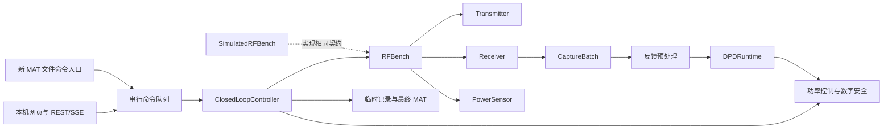
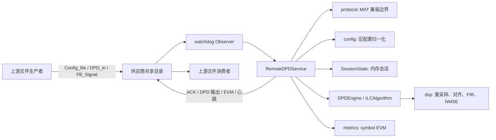
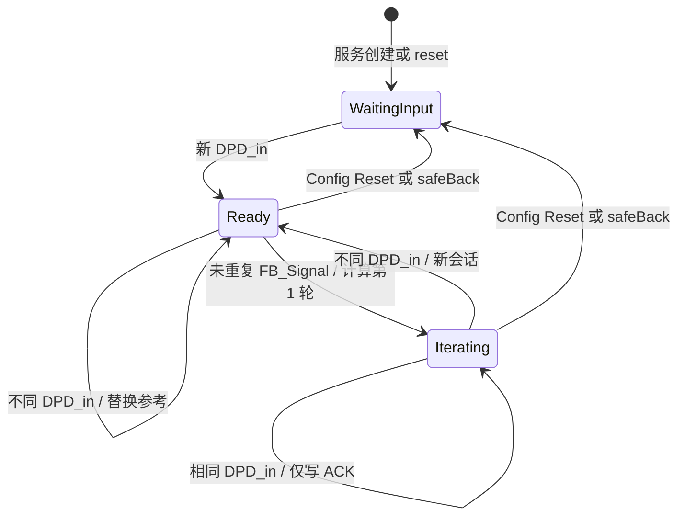

# Remote DPD 系统设计

本文档描述当前仓库中 `remote-dpd` 的实际实现。代码是行为的最终依据；本文不会把预留接口、兼容字段或 README 中的概括表述当成已实现能力。

## [AGENT] 已批准的重构目标（分阶段实施中）

> 本节是已经用户批准、但尚未全部实现的目标设计。下文其余章节描述每个已合入阶段之后的实际行为；未实现能力会继续明确标为后续阶段。详细用户意图、执行顺序、验证方式和风险见本地 `docs/current_plan.md`。

拟将系统重构为设备、预处理、算法 runtime、应用控制、入口和存储六层：



核心边界如下：

- `RFBench` 按发射、接收和功率测量能力组合设备。一体式仪器可实现多项能力，分立仪表可组合；首期只实现仿真设备。
- 预处理负责反馈分段、周期小数时延和相位对齐、相干平均以及首轮固定幅度增益校正。每轮都以原始参考 `x` 对齐时延和相位，但幅度校正值只在第 0 轮估计一次。
- `DPDRuntime` 不接触设备、原始抓取、网页或 MAT 文件。首期基础 ILC 使用 `y_next = y_current - mu * (z_current - x)`，后续通过注册表增加 ILC 变体；具体外部 runtime 加载器延后到真实产物形态确定后实现。
- `ClosedLoopController` 是唯一闭环编排者，使用单任务状态机。网页和文件入口只能提交命令，不得复制设备或算法调用链。
- `x` 是原始周期参考波形，`y` 是已经实际发射并评价的最终数字 DPD 波形，`z` 是对应的最终预处理反馈。

第 0 轮发射 `x`，从较大 TX 衰减开始调节功率。目标从下方逼近：差值大于 `1 dB` 时按 `1 dB` 调节，其余未进入 `0.2 dB` 容差的情况按 `0.1 dB` 调节。超过目标时恢复上一个安全衰减并失败。成功后锁定衰减，后续每轮只在抓反馈前读取物理功率并检查独立安全上限，不再自动调节。

每个候选发射波形在设备调用前执行数字安全检查：所有样点有限、峰值不超过 `0 dBFS`、RMS 不超过原始 `x` 的 RMS `+2 dB`。系统禁止 AGC、自动归一化和静默削峰；失败时不得下发并必须停止任务。

仿真设备使用周期复系数记忆多项式 PA，并模拟固定增益、相位、小数时延、复高斯噪声、TX 衰减、功率测量和单次最大抓取长度。网页允许用表格逐项编辑全部 PA 系数。

网页默认只监听 loopback，不提供鉴权、多用户或并行任务。它同时提供分步控制和自动闭环，并通过设备 schema 动态生成专属配置。服务端仅允许在配置的 waveform root 内选择变量名为 `x` 的 MAT 波形。

可选文件入口采用新的版本化 inbox/outbox MAT 命令协议，通过 `command_id` 幂等地驱动同一个控制器；不兼容现有 `Config_file.mat`、`DPD_in.mat`、`FB_Signal.mat`、ACK、心跳、`safeBack` 或特殊十段输出规则。

每次运行的完整迭代数据保存在自动清理的临时目录，默认保留 7 天。用户显式导出的正式 MAT 只包含最终 `x`、`y`、`z`、最终指标、生效配置、状态和完成时间，不包含迭代历史。

整体重构按四个顺序 PR 完成：核心契约/预处理/基础 ILC，仿真设备/功率控制/闭环状态机，临时存储/正式导出/新文件入口，最后是网页控制台。每一阶段都从当时最新 `origin/main` 创建分支，经 review 合入并清理分支后才开始下一阶段。阶段 1 已进入实现，其余阶段仍不是当前代码能力。

## 1. 系统定位

`remote-dpd` 是一个常驻的 Python 文件监听服务，用于替代旧的 MATLAB Remote DPD 服务。外部设备或上游程序通过共享目录交换 MAT 文件，服务在内存中维护一次 DPD 会话的迭代状态，并使用 ILC（Iterative Learning Control，迭代学习控制）生成下一轮发射波形。

当前实现的边界如下：

- 保留既有的 MAT 文件名和主要变量名，不依赖 MATLAB Engine、MATLAB Runtime 或 MATLAB License。
- 只实现并注册 `ilc` 算法。旧配置中的 MARS、MADE 和 ideal DPD 选择标志不会切换算法。
- 服务本身不提供 HTTP、RPC 或消息队列接口；所谓“远程”通信完全由共享文件系统承担。
- 会话状态只保存在进程内存中，不持久化，也不会在进程重启后恢复。
- 输出采样率转换、PAPR 处理和均衡器开关目前没有进入计算链路，虽然对应配置可被解析。

## 2. 运行环境与部署单元

项目要求 Python 3.10 或更高版本，核心依赖为：

| 依赖 | 当前用途 |
| --- | --- |
| NumPy `>=1.24` | IQ 向量、FFT、指标和 MAT 边界数据处理 |
| SciPy `>=1.10` | MAT v5/v6/v7 读写和多相重采样 |
| PyTorch `>=2.0` | ILC 更新步骤、可选 CUDA 执行和循环 FIR |
| watchdog `>=3.0` | 共享目录的创建、修改和移动事件监听 |
| h5py（可选，未写入项目依赖） | SciPy 对 v7.3 文件抛出 `NotImplementedError` 时的有限 HDF5 读取回退 |

`pyproject.toml` 注册了命令行入口：

```text
remote-dpd = remote_dpd.run_filewatch:main
```

典型启动命令为：

```bash
remote-dpd Zilink --watch-root /opt/SharePoint
```

未指定 `--path` 时，监听目录为 `<watch-root>/<supplier_name>`，默认即 `/opt/SharePoint/Zilink`。指定 `--path` 后直接监听该目录，但 `supplier_name` 位置参数仍用于日志名称和供应商默认配置。

命令行参数的实现值如下：

| 参数 | 默认值 | 说明 |
| --- | --- | --- |
| `supplier_name` | 无，必填 | 供应商目录名和服务标识 |
| `--watch-root` | `/opt/SharePoint` | 供应商目录的父目录 |
| `--path` | 未设置 | 覆盖最终监听目录 |
| `--engine` | `ilc` | `argparse` 当前只允许 `ilc` |
| `--heartbeat-seconds` | `1800.0` | 心跳写入周期，服务内部最小按 `0.1` 秒执行 |
| `--log-level` | `INFO` | 可选 `DEBUG/INFO/WARNING/ERROR` |

CPU 部署可先安装 `requirements-cpu.txt`，该文件将 PyTorch 索引指向 CPU wheel。项目本身没有容器、systemd、进程守护或日志轮转配置，这些需要由部署环境提供。

## 3. 总体架构



### 3.1 模块职责

| 模块 | 职责 | 重要边界 |
| --- | --- | --- |
| `remote_dpd/run_filewatch.py` | 解析 CLI、配置日志、创建服务并常驻运行 | CLI 的 engine choices 目前固定为 `ilc` |
| `remote_dpd/service.py` | 监听生命周期、文件路由、会话编排、ACK/输出写入、心跳和 `safeBack` | 持有唯一的 `SessionState`、当前配置和当前引擎实例 |
| `remote_dpd/protocol.py` | 文件名常量、MAT 加载/保存、MATLAB struct 解包、IQ 向量校验 | 隔离 SciPy/h5py 和 MATLAB 数据形态 |
| `remote_dpd/config.py` | 将旧 `configDPD` 或顶层字段归一化为 `LegacyConfig` | 兼容别名和供应商特定默认值 |
| `remote_dpd/algorithms.py` | `DPDEngine` 扩展接口、引擎注册表和 ILC 实现 | 数值输入与文件协议解耦 |
| `remote_dpd/dsp.py` | RMS、NMSE、循环 FIR、重采样、亚采样对齐和多捕获平均 | 全部以一维复数 NumPy 向量为边界 |
| `remote_dpd/metrics.py` | 基于波形的 OFDM symbol EVM 估算 | 不是完整的 5G NR 解调器 |
| `remote_dpd/state.py` | 显式会话状态和波形 SHA-256 指纹 | 取代旧 MATLAB base workspace 状态 |
| `remote_dpd/exceptions.py` | 协议和算法异常类型 | `UnsupportedAlgorithm` 当前未被引擎工厂使用 |
| `remote_dpd/device.py` | 新设备公共配置、动态参数 schema 和 RF 能力抽象 | 阶段 1 已实现契约，尚无具体设备且未接入旧服务 |
| `remote_dpd/preprocessing.py` | 新反馈批次、时延/相位对齐、相干平均和固定增益校正 | 阶段 1 已实现，尚未接入旧服务 |
| `remote_dpd/runtime.py` | 版本化 DPD runtime、基础 ILC 和进程内注册表 | 与仍被旧服务使用的 `algorithms.py` 并存 |
| `remote_dpd/safety.py` | TX 前的非修改式数字峰值和 RMS 安全检查 | 阶段 1 已实现，控制器接入留待后续阶段 |

### 3.2 核心对象关系

一个 `RemoteDPDService` 实例对应一个监听目录和一份内存会话：

- `config` 保存最近一次成功加载的 `LegacyConfig`。
- `engine` 由该配置转换成 `ILCConfig` 后创建。每次配置文件到达都会重建引擎。
- `state` 在服务实例生命周期内复用，配置重建引擎时不会自动重置。
- `RLock` 保护配置替换、输入状态变更和单次 ILC 状态提交，但 MAT 读取、部分前置读取及输出文件写入不在同一个锁事务内。

### 3.3 阶段 1 新核心的共存边界

设备直控重构的阶段 1 只建立了可独立测试的新核心契约。默认 CLI 和 `RemoteDPDService` 尚未调用这些模块，因此当前部署行为和旧文件协议没有在本阶段改变。

新链路的固定数据语义是：`x` 为原始参考，`y_current` 为已经实际发送的当前数字波形，`CaptureBatch` 为原始反馈批次，预处理结果 `z` 为对齐、平均并应用首轮固定幅度校正后的反馈，runtime 再生成 `y_candidate`。候选必须通过独立数字安全检查后才能在后续控制器中下发。

详细契约分别见 `docs/device_design.md`、`docs/preprocessing_design.md` 和 `docs/algorithm_runtime_design.md`。

## 4. 服务生命周期与并发模型

### 4.1 启动

`RemoteDPDService.start()` 按以下顺序执行：

1. 创建监听目录及其父目录。
2. 动态导入 watchdog；未安装时抛出 `RuntimeError`。
3. 创建递归 `Observer`，注册创建、修改和移动事件。移动事件使用目标路径。
4. 启动 Observer。
5. 清除停止事件，启动 daemon 心跳线程。

服务启动时不会扫描或处理目录中已经存在的 `Config_file.mat`、`DPD_in.mat` 或 `FB_Signal.mat`。这些文件只有在启动后再次产生受监听事件时才会进入处理流程。服务也不会立即写心跳，第一次心跳发生在一个完整心跳周期之后。

`run_forever()` 在主线程中按 `poll_seconds` 等待停止事件，默认 `0.5` 秒。捕获 `KeyboardInterrupt` 后调用 `stop()`；`stop()` 会停止 Observer、最多等待 5 秒，再最多等待心跳线程 2 秒。

### 4.2 事件筛选和文件稳定性

Observer 以 `recursive=True` 监听。因此，根目录的后代路径也会被接收；输入文件从事件文件所在目录读取，但所有 ACK 和算法输出始终写到服务根目录。协议预期仍是直接在根目录交换文件。

事件处理规则如下：

1. 忽略目录事件。
2. 按文件 `stem` 忽略服务自身输出：`sync_dat`、`Config_file_ack`、`ACK_DPDin`、`DPDout_Nokia`、`symbolEVM`。
3. 使用路径字符串记录最近事件的单调时钟时间；与上次事件间隔小于 `stable_seconds`（默认 `0.15` 秒）时直接忽略。
4. 对未忽略事件轮询 `(st_size, st_mtime_ns)`。连续两次相同即认为稳定，两次检查之间休眠 `stable_seconds`。
5. 超过 `settle_timeout_seconds`（默认 `20` 秒）只记录 warning，之后仍继续尝试处理。
6. 事件路径在等待期间消失时结束稳定等待，后续读取若失败则由统一异常处理记录日志。

watchdog 路径中的任意异常都会被 `_on_file_event()` 捕获并记录堆栈，常驻进程继续运行。测试和嵌入式调用可直接调用同步的 `process_file()`；该入口绕过事件去抖和稳定等待，并把异常抛给调用方。

### 4.3 线程和一致性

运行时至少涉及主等待线程、watchdog Observer 的事件线程和心跳线程。当前锁粒度不是完整文件事务：

- 配置 MAT 在锁外读取，配置和引擎在锁内一起替换。
- DPD 输入 MAT 在锁外读取和裁剪，`SessionState.set_reference()` 在锁内执行，ACK 在锁外写入。
- 反馈 MAT、参考状态读取和反馈指纹计算发生在锁外；引擎计算及状态提交发生在锁内；`DPDout_Nokia.mat` 和 `symbolEVM.mat` 在释放锁后写入。
- 心跳写入和 `safeBack` 清理不获取该锁。

因此该实现适合一个生产者按协议顺序驱动一个服务实例，不提供多生产者并发事务、跨文件原子提交或多进程协调。多个服务实例监听同一目录会竞争状态和输出文件，不属于支持的部署方式。

## 5. 文件交换协议

### 5.1 文件路由

`process_file()` 仅按 `Path.stem` 路由以下输入：

| 输入文件 stem | 处理动作 |
| --- | --- |
| `Config_file` | 加载配置、重建引擎、可选重置、写配置 ACK |
| `DPD_in` | 加载参考波形、按起始样点裁剪、更新会话、写输入 ACK |
| `FB_Signal` | 去重并执行一次 ILC、写 DPD 输出和 symbol EVM |
| `safeBack` | 仅当文件直接位于服务根目录时清理根目录普通文件并重置状态 |

其他文件静默忽略。`resolve_file()` 同时接受正常 `.mat` 路径和无扩展名路径：若传入路径没有 `.mat` 后缀，会先检查原路径，再检查同名 `.mat` 文件。

### 5.2 输入契约

| 文件 | 接受的变量 | 校验与归一化 |
| --- | --- | --- |
| `Config_file.mat` | 优先使用 `configDPD` struct；不存在时把顶层 mapping 当成配置 | 各字段按标量首元素读取，详见第 6 节 |
| `DPD_in.mat` | 依次查找 `DPD_In_cut`、`DPD_in`、`DPDin` | 必须非空且为数值类型，转换成扁平 `complex128`；再从 `StartingSample - 1` 开始裁剪 |
| `FB_Signal.mat` | 依次查找 `FB_Signal_cut`、`FB_Signal`、`feedback` | 必须非空且为数值类型，转换成扁平 `complex128` |

缺失、空值或非数值 IQ 变量会抛出 `MatProtocolError`。`DPD_in` 在裁剪前校验非空，但实现没有再次校验裁剪后的向量是否为空。

反馈必须在 DPD 输入之后到达，否则抛出 `MatProtocolError("FB_Signal received before DPD_in")`。配置文件不是处理 DPD 输入和反馈的硬性前置条件；没有配置事件时使用 `LegacyConfig` 默认值。

### 5.3 输出契约

| 文件 | 写入时机 | MAT 变量或文本内容 |
| --- | --- | --- |
| `Config_file_ack.mat` | 每次成功加载配置 | `ACK`: `int8` 标量；`timestamp`: UTC ISO 8601 字符串 |
| `ACK_DPDin.mat` | 每次成功接收 DPD 输入 | `ACK_DPDin`: 值为 1 的 `int8` 标量 |
| `ACK_DPDin.mat` | `Reset=true` 的配置路径 | `ACK`: 值为 0 的 `int8` 标量。该变量名与正常输入 ACK 不同，是当前实现的兼容行为 |
| `DPDout_Nokia.mat` | 每个未重复的反馈成功计算后 | `DPDout_Nokia`: 复数向量；`iter`: 本轮迭代号 `int64`；若反馈含 `ITNum`/`IT_ID`，原样透传这两个字段 |
| `symbolEVM.mat` | DPD 输出写入成功之后 | `symbolEVM`: 每个完整 OFDM symbol 的 EVM 百分比向量，或短捕获的单个全局值 |
| `sync_dat.txt` | 每个心跳周期 | 从 1 开始的进程内计数器和换行，ASCII 编码 |

配置 ACK 的值由状态决定：

- `Reset=true` 时重置会话并写 `ACK=1`，等待 50 ms 后写上述 reset 形式的 `ACK_DPDin.mat`。
- `Reset=false` 且尚无参考波形时写 `ACK=1`。
- `Reset=false` 且已有参考波形时写 `ACK=0`。

协议层通过同目录临时文件 `.<stem>.tmp.mat` 写 MAT v5 文件，再用 `Path.replace()` 替换目标。因此单个 MAT 输出在同一文件系统内采用原子替换。多个输出之间没有原子性，例如 DPD 输出成功而 EVM 输出失败是可能的。心跳使用普通 `write_text()`，不采用临时文件替换。

### 5.4 MAT 格式兼容

加载时优先调用 `scipy.io.loadmat(..., squeeze_me=True, struct_as_record=False)`，删除以 `__` 开头的元数据，并递归把 scipy MATLAB struct、structured array、object array 和 mapping 解包为 Python 容器。普通数值数组保持 NumPy 数组。

仅当 SciPy 抛出 `NotImplementedError` 时才尝试 `h5py`。该回退只遍历 HDF5 顶层对象，并能直接返回实数、整数、无符号整数或复数 dataset；它没有实现 MATLAB v7.3 struct、object reference 和 group 的完整解码。因此 v7.3 支持是有限的，并且 `h5py` 需要额外安装。SciPy 抛出的 `OSError` 或 `ValueError` 会直接包装为 `MatProtocolError`，不会进入 h5py 回退。

保存始终使用 `scipy.io.savemat()` 生成未压缩的 MAT v5 文件，并启用长字段名。

### 5.5 `safeBack` 行为

文件 stem 为 `safeBack` 时触发清理，但只有触发文件所在目录解析后恰好等于服务根目录才执行；子目录中的同名文件只记录 warning。

执行时遍历根目录的直接子项，删除所有文件，但保留文件名严格等于 `safeBack` 的文件。子目录及其内容不删除。若触发文件名是 `safeBack.mat`，它也会因文件名不等于 `safeBack` 而被删除。清理完成后调用 `SessionState.reset()`，没有 ACK 文件。

删除循环没有逐文件异常隔离；任一 `unlink()` 失败都会中止后续删除，且本次不会执行末尾的状态重置。watchdog 调用路径会记录该异常后继续运行服务。

该能力会删除协议目录中的普通文件，部署时必须把监听目录视为受信任、专用目录，并限制谁可以创建 `safeBack` 文件。

## 6. 配置模型

### 6.1 归一化规则

`config_from_mat()` 从 `configDPD` 或顶层 mapping 生成 `LegacyConfig`。MATLAB 数组字段一般只取扁平后的第一个元素。

| 输入字段及别名 | 默认值/转换 | 当前消费位置 |
| --- | --- | --- |
| `supplierName` | 服务传入的供应商名；转换为字符串 | 决定 Zilink 特定的学习率和相位补偿默认值；不会改写服务自身的 `supplier_name` |
| `InternalSamplingRate` | `983.04` MHz，之后无条件乘 `1e6` | ILC 输入采样率、反馈重采样目标和 EVM |
| `FeedbackSamplingRate` / `FBSamplingRate` | 默认等于内部采样率，单位 MHz，之后乘 `1e6` | ILC 反馈重采样比 |
| `OutputSamplingRate` | 默认等于内部采样率，单位 MHz，之后乘 `1e6` | 传入 `ILCConfig`，但当前算法未使用，不执行输出重采样 |
| `BW` / `FB_BW` | `700.0`；小于 `1e6` 时按 MHz 乘 `1e6`，否则按 Hz 保留 | symbol EVM 参数选择 |
| `LearningRate` | `0.5`；非有限值或小于等于 0 时回退到 `0.5` | ILC 的 `mu` 基础值 |
| `ILCMu` / `mu` | 若存在则覆盖学习率；覆盖值不再做有限性和正值校验 | ILC 的 `mu` |
| `StartingSample` | `1`，取整数且最小为 1 | 输入裁剪和输出零前缀，使用 MATLAB 风格的一基索引语义 |
| `alpha` | `0.0` | ILC 更新公式 |
| `dpdGainDb` | `0.0` dB | ILC 增益因子 |
| `phaseCompensate` / `phase_compensate` | Zilink/Zillnk 默认 true，其他供应商默认 false；字符串仅把 `1/true/yes/on` 视为 true | ILC 误差相位补偿 |
| `phaseCompThr` / `phaseCompensationThreshold` | `0.15`；非有限值或小于等于 0 时回退 | 相位补偿门限比例 |
| `txFirHd` / `tx_fir` | 转成一维 `float64`；只有多于 1 个 tap 才启用 | ILC 更新结果的循环 FIR |
| `errFirHd` / `err_fir` | 同上 | ILC 误差的循环 FIR |
| `PAPR` | `7.5` dB | 保存到配置，但当前未使用，无削峰或 PAPR 约束 |
| `enableEq` | false | 保存到配置，但服务调用 EVM 时未传 equalizer，当前未生效 |
| `Reset` | false | 配置处理器重置会话 |
| `debug` | false | 保存到配置，但不改变当前日志或算法路径 |
| 其他字段 | 保存在 `LegacyConfig.extra`，并传入 `ILCConfig.extra` | 当前 ILC 不读取 `extra` |

当供应商名忽略大小写后是 `zilink` 或兼容拼写 `zillnk`，且 `LearningRate`、`ILCMu`、`mu` 三者均未出现时，学习率默认覆盖为 `0.3`。只要三者任一出现，就走通用覆盖逻辑。

当前 `known` 字段集合没有列出 `alpha`、`dpdGainDb`、`tx_fir` 和 `err_fir`。因此这些字段或别名在被相应强类型属性消费的同时，也会重复保留在 `extra` 中；ILC 不读取这份重复值。

旧字段 `run_idealDPD`、`enILC` 和 `idealDPD` 被当作已知兼容元数据：它们不进入 `extra`，也不参与算法选择。当前服务无论这些字段取何值都使用构造时指定的引擎，而 CLI 只允许 `ilc`。

### 6.2 数值配置对象

`ILCConfig.from_legacy()` 只把算法所需字段从 `LegacyConfig` 复制到数值层。`device` 和 `dtype` 没有 MAT 或 CLI 配置入口，始终使用类默认值：

- `device="auto"`：CUDA 可用时选 `cuda`，否则选 `cpu`。
- `dtype="complex64"`：计算张量默认使用 PyTorch `complex64`。
- 算法返回时统一转回 NumPy 扁平 `complex128`。

## 7. 会话状态机

`SessionState` 字段如下：

| 字段 | 初始值 | 含义 |
| --- | --- | --- |
| `reference` | `None` | 从 `DPD_in` 裁剪后的参考波形 |
| `current_dpd` | `None` | 最近一次 ILC 结果，下一轮作为当前输出 |
| `iteration` | `1` | 下一次反馈计算使用的迭代号 |
| `last_feedback_id` | `None` | 最近已提交反馈的 SHA-256 指纹 |
| `last_input_id` | `None` | 当前参考波形的 SHA-256 指纹 |
| `last_metrics` | `None` | 最近一次引擎返回的 metrics，不包含服务随后计算的 symbol EVM 均值 |

波形指纹由数组 shape、dtype 字符串和连续内存字节共同计算 SHA-256。输入和反馈在计算指纹前已经被协议层转为扁平 `complex128`，输入还已经应用 `StartingSample` 裁剪。



状态转换的精确规则是：

- `reset()` 清空两个波形、两个指纹和 metrics，并把迭代号设回 1。
- `set_reference()` 遇到与当前 `last_input_id` 相同的波形且 `reference is not None` 时返回 false，不重置当前 DPD 或迭代号；处理器仍写成功 ACK。
- 新参考波形会转换为扁平 `complex128` 数组，清空当前 DPD、反馈指纹和 metrics，并把迭代号设为 1。
- 新反馈在锁内完成计算后，先保存输出、反馈指纹和引擎 metrics，读取本轮迭代号，再把 `iteration` 加 1。
- 与 `last_feedback_id` 相同的反馈完全忽略，不重写输出，也不推进迭代号。
- `Reset=false` 的新配置会替换配置和引擎，但保留参考波形、当前 DPD、反馈指纹和迭代号。

状态提交先于输出文件写入。因此，如果引擎成功且状态已推进，但随后 `DPDout_Nokia.mat` 或 `symbolEVM.mat` 写入失败，再次投递完全相同的反馈会被视为重复并忽略。当前实现没有回滚、提交日志或自动重试，这是一项明确的非事务性边界。

## 8. ILC 处理流程

### 8.1 输入选择与特殊打包格式

`ILCAlgorithm.process(reference, current_output, feedback, state)` 首先把参考和反馈转换为一维 `complex128`。第一轮没有 `current_output` 时，以原始参考波形作为当前 DPD；后续使用上一轮结果。

存在一条硬编码的旧传输兼容路径：当原始反馈长度恰好为 `327680` 且参考长度至少为 `32768` 时：

- 工作长度固定为 `32768`，参考和当前 DPD只取前 `32768` 点。
- 只训练一个 `32768` 点结果。
- 最终把结果重复 10 次，输出 `327680` 点。

除此之外，工作长度等于参考长度。如果当前 DPD 较长则截断，较短则在尾部补复数零。

反馈先按以下比率重采样：

```text
ratio = input_sample_rate_hz / feedback_sample_rate_hz
```

比率与 1 的误差小于 `1e-12` 时精确复制；否则用 `Fraction(...).limit_denominator(4096)` 得到有理数，再调用 `scipy.signal.resample_poly()`。比率非有限或小于等于 0 时抛出 `ValueError`。

十捕获识别发生在重采样之后：若反馈长度恰好是工作参考长度的 10 倍，按 MATLAB/Fortran 顺序重排为 10 段并分别对齐后求平均；否则把全部反馈视为单次捕获。对于硬编码的 `327680` 格式，非 1:1 重采样可能使长度不再满足十倍条件，此时仍会走 32768 点训练和十次输出复制，但对齐层会把重采样结果当成单次捕获并按工作长度截断。

### 8.2 波形对齐

每个捕获通过 `align_signal()` 对齐到工作参考：

1. 两个向量先截为共同最短长度。
2. 使用频谱中心补零的周期 FFT 插值，把两者上采样 32 倍。
3. 计算周期互相关，选择幅度最大点，并映射为有符号延迟。
4. 延迟精度为 `1/32` 样点；通过频域线性相位完成原采样率上的循环分数延迟。
5. 计算复数相位和 RMS 比例系数，使反馈的相位和 RMS 对齐参考。

十个捕获分别对齐后在样点维度求均值。算法记录每个捕获的延迟和复增益系数幅度。

### 8.3 更新公式

记：

- `r` 为工作参考；
- `u_k` 为当前 DPD，第一轮等于未加增益的 `r`；
- `y_k` 为重采样、对齐并平均后的反馈；
- `G = 10^(gain_db / 20)`；
- `r_g = G * r`；
- `mu` 为学习率，`alpha` 为参考混合系数。

基础误差为：

```text
e_k = y_k - r_g
```

启用相位补偿时，代码按当前 DPD 和反馈幅度构造软权重。门限为 `phase_threshold * RMS(r_g)`，且不小于张量实数 dtype 的 epsilon。当 `|u_k| > max(0.1 * threshold, epsilon)` 时，补偿相位为 `conj(sign(y_k / u_k))`；其他样点的相位因子为 1。误差乘以下式：

```text
w = |u_k|^2 / (|u_k|^2 + threshold^2)
    * |y_k|^2 / (|y_k|^2 + threshold^2)

e_k <- e_k * (w * phase + (1 - w))
```

随后可对误差应用 `error_fir`。记处理后的误差为 `e'_k`，代码中的更新公式精确为：

```text
u_(k+1) = G * alpha * r_g
          + (1 - alpha) * u_k
          - G * mu * e'_k
```

注意 `r_g` 已经包含一次 `G`，所以第一项在 `alpha != 0` 时实际包含 `G^2`。本文保留这一实现语义，不把它简化成不同公式。

最后可对 `u_(k+1)` 应用 `tx_fir`。两个 FIR 都采用中心对齐的循环卷积：PyTorch 实现逐 tap 使用 `torch.roll()`，不会引入零填充边缘。`dsp.circular_fir()` 提供相同设计意图的 NumPy 原语并由单元测试覆盖，但 ILC 热路径实际调用的是 `_apply_fir_torch()`。

### 8.4 输出长度与起始样点

引擎返回工作结果或十次复制结果后，服务在最前面拼接 `StartingSample - 1` 个复数零，再写 `DPDout_Nokia`。因此输出长度等于引擎结果长度加该前缀；服务不会按 `OutputSamplingRate` 进行二次重采样。

`current_dpd` 保存的是不含 `StartingSample` 零前缀的引擎结果。该值传给下一轮迭代，算法再根据本轮工作长度决定保持、截断或补零。

## 9. 指标与可观测性

### 9.1 引擎 metrics

每次 ILC 返回以下内存指标，并保存到 `state.last_metrics`：

| 字段 | 计算方式 |
| --- | --- |
| `iteration` | 计算开始时的 `state.iteration` |
| `aligned_nmse_db` | `10*log10(||feedback-r_g||^2 / ||r_g||^2)`；参考能量过小时为 NaN |
| `feedback_gain_correction_db` | 所有对齐增益幅度均值的 `20*log10`，以 float tiny 防止 log(0) |
| `alignment_delays` | 各捕获施加的有符号延迟，单位为样点 |
| `capture_count` | 对齐捕获数量，通常为 1 或 10 |
| `feedback_rms` | 对齐平均反馈的 RMS |
| `output_rms` | 引擎返回结果的 RMS；打包路径下对重复后的完整结果计算 |

这些 metrics 没有单独写入文件。服务随后计算 `symbol_evm_mean_percent`，仅用于本次日志局部字典，不回写 `state.last_metrics`。

### 9.2 Symbol EVM

`symbol_evm()` 不是网格级 NR 解调，而是按估算的 OFDM symbol 边界比较两个时域波形：

1. 测量和参考截为共同最短长度，并分别归一化到单位 RMS。
2. 带宽严格等于 `20e6` 时选择 15 kHz SCS，其他带宽一律选择 30 kHz SCS。
3. 从内置 RB 表中选择最接近的带宽项，计算 NFFT、过采样比和 CP 长度。表中虽有 60 kHz 数据，当前选择逻辑不会使用它。
4. 长度不足一个最短 symbol 时，返回一个由全局 NMSE 换算的百分比。
5. 否则逐个跳过 CP，对完整 NFFT 窗计算 `100 * ||measured-reference|| / ||measured||`。

函数支持传入频域 equalizer，且只在 equalizer 长度等于 NFFT 时应用；当前服务调用没有传该参数，所以 `enableEq` 不会启用均衡。

### 9.3 日志和心跳

启动、停止、配置加载、输入接收、重复反馈、每轮 NMSE/EVM、`safeBack` 清理和异常都会通过 Python logging 输出。没有结构化日志、metrics endpoint 或外部监控集成。

心跳计数器只在内存中递增，进程重启后从 1 重新开始。心跳文件只能证明最近一次周期写入成功，不包含时间戳、进程 ID、会话或算法健康状态。

心跳循环没有捕获 `write_text()` 异常。若一次心跳写入失败，心跳线程会退出，但主服务和 watchdog 仍可继续运行；当前没有线程存活检查或自动重启。

## 10. 错误处理和恢复语义

异常层次定义为：

```text
RemoteDPDError
├── MatProtocolError
│   └── UnsupportedMatVersion
└── UnsupportedAlgorithm
```

实际使用情况：

- MAT 读写和 IQ 变量错误包装为 `MatProtocolError`。
- 缺少 h5py 的 v7.3 回退抛出 `UnsupportedMatVersion`。
- PyTorch 缺失时，ILC 处理抛出 `RuntimeError`；服务构造本身仍可成功，因为导入错误被延迟到 `process()`。
- `create_engine()` 对未知名称抛出 `ValueError`，当前不使用已定义的 `UnsupportedAlgorithm`。
- watchdog 事件路径捕获所有异常、记录日志并继续；没有失败 ACK、隔离目录、重试队列或告警回调。
- 直接调用 `process_file()` 时异常向上传播，便于测试或由嵌入方自行处理。

恢复通常依赖上游修正文件后再次产生事件。反馈去重和“状态先提交、文件后写入”的顺序意味着输出写入失败不能通过原样重放同一反馈恢复；需要新反馈、重置或进程重启来重新进入处理。

## 11. 扩展设计

算法层的扩展接口是 `DPDEngine.process(reference, current_output, feedback, state) -> ILCResult`。新引擎类型必须继承 `DPDEngine`，实现 `process()`，并通过 `register_engine(name, engine_type)` 加入进程内 `_ENGINES` 注册表。

`register_engine()` 要求非空名称和 `DPDEngine` 子类，但按传入名称原样存储；`create_engine()` 会先把查询名称转成小写。因此可被工厂正常查找到的注册名称应使用小写。工厂还会以单个 `ILCConfig` 参数调用引擎构造函数。

需要注意当前扩展边界仍有 ILC 假设：

- `create_engine()` 构造参数类型固定为 `ILCConfig`。
- 返回值固定为 `ILCResult`。
- 服务总会计算 symbol EVM，并预期 metrics 中存在用于日志格式化的 `aligned_nmse_db`。
- CLI 的 `--engine` choices 固定为 `("ilc",)`，程序化注册的新引擎不能直接通过现有 CLI 选择。

因此当前接口适合 ILC 变体的程序化扩展；若要支持结构明显不同的模型 DPD，还需要同步泛化配置类型、结果协议、日志字段和 CLI 注册机制。

文件协议与算法边界已经通过 `protocol.py`、`config.py` 和 `DPDEngine` 分层。新增 MAT 别名应放在协议或配置层，新增纯数值算法不应直接读写文件。

### 11.1 新 DPD runtime 契约

阶段 1 新增的 `DPDRuntime` 是后续设备直控链路使用的替代边界，不改变当前 `DPDEngine` 行为。它使用 API 版本、显式生命周期、不可变 `RuntimeStepInput`/`RuntimeStepResult` 以及独立注册表，消除了旧接口对 `ILCConfig`、`SessionState` 和 `ILCResult` 的固定依赖。

当前只注册 `basic_ilc`，其公式为 `y_candidate = y_current - mu * (z_current - x)`。预处理和数字安全分别位于 runtime 前后，不允许 runtime 隐式对输入或输出做对齐、归一化、AGC 或削峰。新控制器接入后，旧 `DPDEngine` 才会随旧文件服务一起退出。

## 12. 测试现状

仓库使用 Python `unittest`，阶段 1 后测试覆盖：

- 整数延迟及复增益的波形对齐。
- 十捕获反馈的识别和平均结果长度。
- NumPy 循环 FIR 的长度保持。
- MAT struct 的保存和加载回环。
- 配置、DPD 输入、反馈、DPD 输出和 EVM 的同步端到端文件交换。
- 完全相同反馈的幂等去重和迭代号不推进。
- 设备公共配置、动态 schema、抓取请求以及一体式多能力设备的类型契约。
- coherent 单批对齐复用、非 coherent 逐段对齐、多批独立对齐、相干平均降噪和首轮固定增益。
- DPD runtime 生命周期、配置一致性、基础 ILC、注册表、状态隔离和不可变输入输出。
- `0 dBFS` 峰值、相对参考 RMS `+2 dB`、非有限值、长度错误和零参考等数字安全边界。

当前没有直接覆盖：watchdog 真实事件和稳定等待、心跳、`safeBack`、配置字段全部别名、reset ACK 的变量名差异、v7.3/h5py、采样率变化、327680 特殊路径、相位补偿、两个 Torch FIR、CUDA、输出失败后的状态一致性及 symbol EVM 的长捕获路径。新契约尚无具体设备、功率控制器、仿真 PA、闭环状态机、存储、文件入口或网页测试，这些属于后续阶段。

标准验证命令为：

```bash
python -m unittest discover -s tests -v
```

## 13. 已知约束与设计结论

- 文件到达顺序是协议的一部分：至少需要先有 DPD 输入，再有反馈；配置可省略而使用默认值。
- 仅使用内容指纹保证输入会话和反馈迭代的幂等性，没有请求 ID、文件版本或持久化去重记录。
- 服务重启会丢失全部状态，也不会接管启动前已经存在但不再变化的输入文件。
- 单个 MAT 文件采用原子替换，但一次反馈涉及状态、DPD 输出和 EVM 三个独立提交点，整体不是事务。
- 监听目录必须是服务专用且可信的目录，尤其因为 `safeBack` 能删除其根目录普通文件。
- 输入/反馈对齐采用周期信号假设；FFT 插值、分数延迟和 FIR 都具有循环边界语义。
- `OutputSamplingRate`、`PAPR`、`enableEq` 和 `debug` 是已解析但未生效的配置；旧算法选择字段只是兼容元数据。
- 当前性能主要受 32 倍 FFT 对齐和 PyTorch 张量转换影响。实现没有批处理队列、背压、资源上限或超长输入保护。
- 当前最可靠的运行模型是：一个服务进程对应一个供应商目录，由一个上游控制器按配置、参考、反馈的顺序串行驱动。
